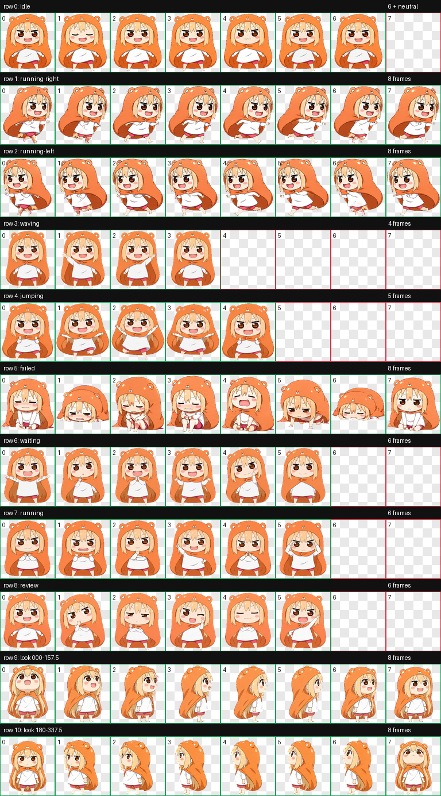

# 小埋 · Umaru Pet

一只穿着橙色仓鼠斗篷的 Codex 桌面宠物，采用《干物妹！小埋》的宅家迷你形态，陪你写代码、等结果，偶尔一起发个呆


## 特性

- 九组标准动作：待机、向右移动、向左移动、挥手、跳跃、受挫、等待回应、专注工作、审阅
- 十六个顺时针视线方向，覆盖抬头、低头、左右转头及中间方向
- 支持 Codex v2 宠物格式，使用带透明通道的 WebP 图集
- 无需构建或安装依赖，复制两个文件即可安装

## 安装

需要支持 v2 自定义宠物的 Codex 桌面应用

下载本仓库后，在仓库根目录运行以下命令，适用于 Linux 和 macOS

```bash
PET_DIR="${CODEX_HOME:-$HOME/.codex}/pets/umaru"
mkdir -p "$PET_DIR"
cp pet.json spritesheet.webp "$PET_DIR/"
```

安装后，在 Codex 的宠物选择界面选择「小埋」；若列表尚未更新，重启应用后查看

安装命令会更新同名的 `umaru` 宠物，已有自定义版本时请先备份该目录

## 动作预览



查看 [逐组动画预览](qa/previews/) 或 [十六方向视线对照](qa/look-directions.png)

## 文件说明

| 文件 | 用途 |
| --- | --- |
| `pet.json` | 宠物标识、显示名称和 v2 格式声明 |
| `spritesheet.webp` | 运行所需的透明动画图集 |
| `preview.png` | 静态预览 |
| `main-look.png` | 生成时使用的主形象，保留洋红色背景 |
| `qa/` | 动画预览、方向检查和验证记录 |
| `LICENSE` | MPL-2.0 许可证全文 |

图集尺寸为 **1536 × 2288**，按 **8 列 × 11 行**排列，每格 **192 × 208**；前九行为标准动作，最后两行为十六个视线方向

## 制作与验证

图像使用 OpenAI 内置图像生成功能制作，通过 hatch-pet 流程完成逐帧提取、图集合成、透明边缘清理和验证

仓库附带的验证记录显示，v2 图集格式检查、三位独立检查者的方向盲测和最终视觉检查均通过

部分中间方向的视线变化较含蓄，闭环处有轻微尺寸和表情差异，详见 [检查备注](qa/blind-review-resolution.json)

动画视觉检查覆盖全部 57 个标准动作帧，采用逐帧时间序列检查，未直接实时播放 GIF；仓库中的验收记录不代表已验证所有 Codex 版本的桌面运行表现

## 许可证

本项目采用 **Mozilla Public License 2.0（MPL-2.0）** 开源，详见 [LICENSE](LICENSE)

本项目为非官方同人作品，《干物妹！小埋》及其角色的相关权利归原权利人所有；MPL-2.0 声明不授予第三方角色、商标或其他独立权利
